# Bildinterpolation

---

## Motivation

Unsere Idee bestand darin eine Animation zwischen einem gegebenen Start- und Endbild zu erstellen. Dabei war die Vorstellung, dass die potentielle Bewegung zwischen den beiden Bildern korrekt erkannt wird und dementsprechend die Zwischenbilder generiert werden.
Wir haben während der Bearbeitung zwei Architekturansätze verfolgt, auf die hier im Folgenden näher eingegangen wird.

## Informationen zu verwendeten Datensätzen

Für das Training unserer neuronalen Netze haben wir zwei Datensätze verwendet.

### Cartoonset100k / Cartoonset10k

Bei dem Cartoonset handelt es sich um einen Datensatz mit verschiedenen Cartoongesichtern.
Jedes Gesicht ist dabei aus 18 verschiedenen Eigenschaften geformt: </br>

1. Kinnlänge
2. Augenwinkel
3. Wimpern
4. Augenlid
5. Augenbrauenform
6. Augenbrauen-Linienbreite
7. Gesichtsform
8. Gesichtsbehaarung
9. Brille
10. Haare
11. Augenfarbe
12. Gesichtsfarbe
13. Brillenfarbe
14. Haarfarbe
15. Augenbrauen-Abstand
16. Augenneigung
17. Augenbrauendicke
18. Augenbrauenbreite

Die entsprechende Website für den Datensatz ist <a href="https://google.github.io/cartoonset/download.html"> hier</a> zu finden

### Vimeo90K-Triplet Datensatz

Der Vimeo90K Datensatz beinhaltet drei-Bilder Sequenzen aus verschiedenen Videos der Plattform Vimeo.
Dieser ist für unser Projekt von besonderer Bedeutung, da wir ein Start- und Endbild und ein Bild in der Mitte haben.
Anders als der Cartoon Datensatz, bildet dieser Datensatz keine besondere Domäne ab.

Der Datensatz ist <a href="http://toflow.csail.mit.edu/">hier</a> zu finden.

## Autoencoder Ansatz

### Modifikation dee MNIST-Netzarchitektur mit RGB-Bildern & erhöhter Auflösung

Wir haben uns an der gegebenen Autoencoder-Architektur am Beispiel des MNIST-Datensatzes von Tensorflow orientiert:
https://www.tensorflow.org/tutorials/generative/cvae

Die Input-Daten des neuronalen Netzes hat die Form (batch_size, height, width, depth).
Bei der ursprünglichen Architektur war die konkret (batch_size, 28, 28, 1),
d. h. es handelt sich hierbei um schwarz-weiß Bilder mit einer Auflösung von 28 x 28, wo jeder Pixel durch ein Grauwert dargestellt wird.

Um die Auflösung zu erhöhen, muss im InputLayer des Encoders die Höhe und Breite der neuen Auflösung angegeben werden. In unserem Fall 256 x 256.
Anstatt Grauwerte für Verarbeitung des Bildes zu verwenden, wollen wir RGB-Farben nutzes,
weswegen wir die Tiefe des Bildes von 1 auf 3 erhöht haben, wobei jede Ebene entweder Rot, Grün oder blau repräsentiert.

Anstatt der alten Dimension (batch_size, 28, 28, 1) nutzen wir nun (batch_size, 256, 256, 3), um farbige Bilder mit erhöhter Auflösung verarbeiten zu können.
Ggf. müssen die darauffolgenden Conv2D-Layer ebenfalls angepasst werden.

### Erzeugung eigener Trainingsdaten und Probleme

Zu Beginn war unsere Idee eigene Trainingsdaten zu erzeugen. Dafür haben wir uns eine simple Szene in Unity3d geschrieben, welche Zufällig eine Pille durch den Raum schweben lässt, um eine simple Bewegung zu simulieren.

Wir haben innerhalb jedes Frames ein Screenshot von der Unity-Szene abgespeichert und diese einzelnen Bilder dann als Trainingsdaten genutzt.
Hier wurde jedoch schnell klar, dass die Trainingsdaten aufgrund der hohen Ähnlichkeit schnell zu einem Overfitting geführt haben.

Beispiel:

<div style="display:flex;flex-direction:row" width=80%>
    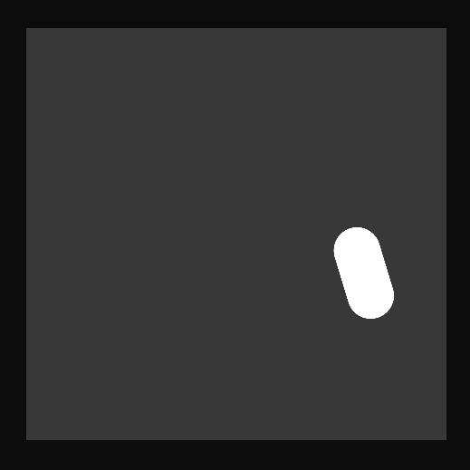
    
    
</div>
Also haben wir uns dazu entschieden diesen Ansatz nicht weiter zu verfolgen.

### Training des VAE mittels Cartoon Face Datensatz 

Nach den Mnist Ziffern haben wir nach einem neuen Datensatz gesucht, der farbige, größere Bilder enthält und natürlich auch eine gewisse Größe hat. Der Cartoon Face Datensatz bot sich dafür hervorragend an, da er all diese Kriterien erfüllte. Außerdem ermöglichte er visuell recht gut nachzuvollziehen was für Features unser Netz zu einem gewissen Zeitpunkt X schon erlernt hat. So erlente unser Netz zum Beispiel immer zuerst verschiedene Gesichtsformen und erst später unterschiedliche Farben und Accessoires. Somit konnten wir nicht nur anhand der Höhe des Losses unseren Trainingsfortschritt beobachten, sondern diesen auch visuell verfolgen. Die Gesichter des Datensatzes waren einerseits ausreichend vielfältig andererseits auch ähnlich genug, um einen Vergleich und sinnvolle Kombinationen unterschiedlicher Vektoren zu ermöglichen.

Anfängliche Schwierigkeiten beim Training ergaben unser Team-Maskottchen:<br />
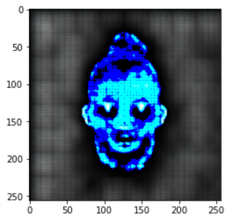
<br />Training über 50 Epochen:<br />
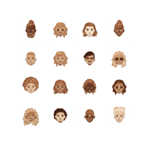
<br />Ausgereifteres Training mit mehr erlernten Farben: <br />
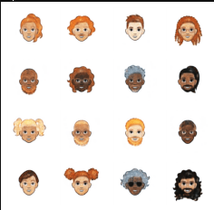

### weitere Experimente mit Modifikation der Latentvektoren

Ein größerer Latentvektor führt in der Praxis schnell zu einer deutlich erhöhten Anzahl an trainierbaren Parametern, somit dauert der Trainingsvorgang einer Epoche länger, jedoch konvergiert das Netz auch schneller und somit gleicht sich das ungefähr aus.
Wählt man jedoch einen übertrieben deutlich zu kleinen, oder großen Latentspacevektor, so gleicht sich das mit der Trainingsdauer nicht mehr aus. Ein viel zu kleiner Latentspacevector ist nur mit sehr genau trainierten Parametern dazu in der Lage auf dem gleichen Detailgrad Informationen zu speichern, wie ein größerer Latentspacevektor. Genauso kann ein sehr großer Latentspacevektor zwar viele Informationen halten, kann aber zu Overfitting führen und auf einmal Informationen enthalten, die zu fehlern führen. Außerdem dauert das Training dann wirklich sehr lang.

Größen-Range bei der sich die Trainingsdauer ungefähr ausglich: 50-200 Dimensionen

### weitere Experimente mit Modifikation der Architektur

Bei der Architektur ergaben die Tests sehr ähnliche Ergebnisse wie die der Latentspacevektoren. Ein komplexeres Netz trainiert zwar pro Epoche langsamer, konvergiert aber schneller. Und genau umgekehrt bei weniger komplexen Netzen. Macht auch Sinn, da hier im Grunde auch nichts anderes passiert, genau wie bei Veränderungen der Größe der Latentspacevektoren, als die Anzahl der trainierbaren Parametern zu verändern. So lange hier nichts grundlegends an der Architektur verändert wird, lohnt sich eine Modifikation nicht.

<b>Beispiel Architektur unseres CVAEs</b>

```python
class CVAE(tf.keras.Model):
  """Convolutional variational autoencoder."""

  def __init__(self, LATENT_DIM_SIZE):
    super(CVAE, self).__init__()
    self.LATENT_DIM_SIZE = LATENT_DIM_SIZE
    self.encoder = tf.keras.Sequential(
        [
            tf.keras.layers.InputLayer(input_shape=(256, 256, 3)),
            tf.keras.layers.Conv2D(
                filters=32, kernel_size=3, strides=(2, 2), activation='lrelu'),
            tf.keras.layers.BatchNormalization(name='bn_1'),
            tf.keras.layers.Conv2D(
                filters=64, kernel_size=3, strides=(2, 2), activation='lrelu'),
            tf.keras.layers.BatchNormalization(name='bn_2'),
            tf.keras.layers.Conv2D(
                filters=64, kernel_size=3, strides=(2, 2), activation='lrelu'),
            tf.keras.layers.BatchNormalization(name='bn_3'),
            tf.keras.layers.Flatten(),
            # No activation
            tf.keras.layers.Dense(LATENT_DIM_SIZE + LATENT_DIM_SIZE),
        ]
    )

    self.decoder = tf.keras.Sequential(
        [
            tf.keras.layers.InputLayer(input_shape=(LATENT_DIM_SIZE,)),
            tf.keras.layers.Dense(units=8*8*64, activation=tf.nn.relu),
            tf.keras.layers.Reshape(target_shape=(8, 8, 64)),
            tf.keras.layers.Conv2DTranspose(
                filters=64, kernel_size=3, strides=2, padding='same',
                activation='lrelu'),
            tf.keras.layers.BatchNormalization(name='bn_4'),
            tf.keras.layers.Conv2DTranspose(
                filters=32, kernel_size=3, strides=2, padding='same',
                activation='lrelu'),
            tf.keras.layers.BatchNormalization(name='bn_5'),
            tf.keras.layers.Conv2DTranspose(
                filters=32, kernel_size=3, strides=2, padding='same',
                activation='lrelu'),
            tf.keras.layers.BatchNormalization(name='bn_6'),
            tf.keras.layers.Conv2DTranspose(
                filters=32, kernel_size=3, strides=2, padding='same',
                activation='lrelu'),
            tf.keras.layers.BatchNormalization(name='bn_7'),
            # No activation
            tf.keras.layers.Conv2DTranspose(
                filters=3, kernel_size=3, strides=2, padding='same', activation='sigmoid'),
        ]
    )
```

### Gewichtung der Latentspace Vektoren

Eine Gewichtung der Latentspacevektoren war tatsächlich möglich. So konnten wir uns zwei verschiedene Vektoren, von zwei verschiedenen Cartoon Faces, schnappen sie unterschiedliche Gewichten und dann addieren. Das generierte Bild aus diesem neuen Vektor entsprach sogar ungefähr unseren menschlichen Vorstellungen. Nahm man zum Beispiel das Bild eines Cartoon Faces mit blonden Haaren und das eines mit schwarzen, und kombinierte diese beiden Vektoren nun mit jeweils 50% Gewichtung, kam nicht eine Farbe die genau zwischen den beiden Haarfarben liegt heraus, sondern das dunklerere Haar dominierte.

### Training VAE auf Triplet 90kViemo-Datensatz

Wir haben das Netz auf einer Teilmenge des Vimeo90k-Datensatzes für 150 Epoche trainieren lassen, wobei ein Latent Space von 200 gewählt wurde.
Trotz des hohen Latent Spaces waren die reproduzierten Bilder des Autoencoders leider sehr verschwommen und undeutlich:

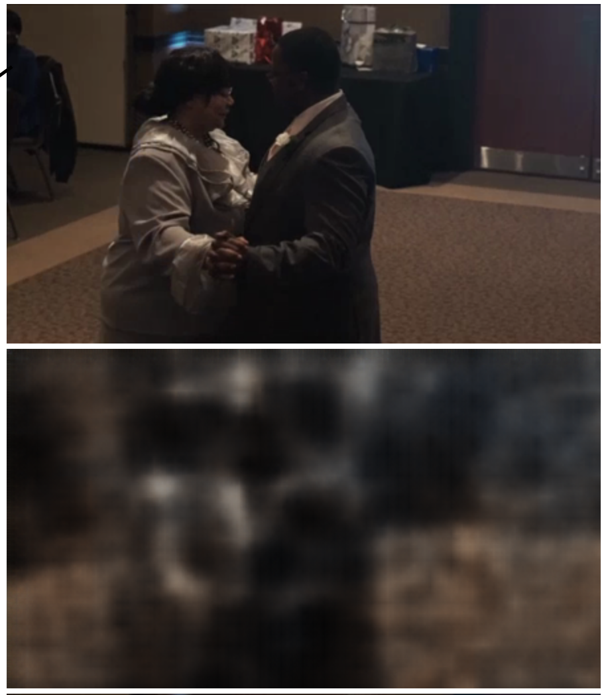
<br>
Oben das Input-Bild, unten das erzeugte Bild des Decoders
<br>

Unsere Vermutung ist, dass das Vimeo90k-Datensatz sehr vielfältige Bilder in verschiedenen Motiven hat im Gegensatz zum MNIST- & CartoonFace-Datensatz und dadurch die Reproduktion der Bilder schwierig ist.

### Ergebnisse

Normalverteilung über dem Latentspacevektor:
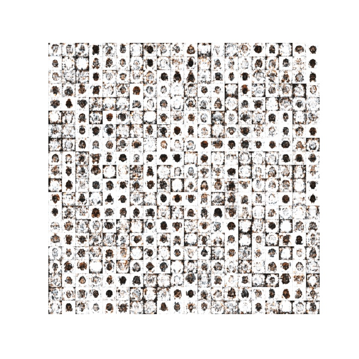

## CNN Ansatz

### Verwendete Architektur

Wir entschieden uns zur Implementierung des Netzes, das im Paper [Learning Image Matching by Simply Watching Video](https://arxiv.org/pdf/1603.06041.pdf) vorgestellt wird:

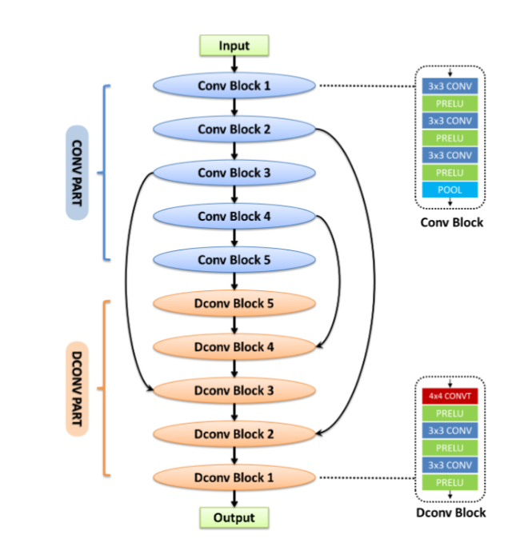

Dieses Modell trägt den Namen "Mind" und ist nach unserer Recherche die erste Netz-Architektur die für Video-Interpolation genutzt wurde. Wir entschieden uns für diese Architektur da sie deutlich leicher nachvollziehen ist, als bestehende state-of-the-art Architekturen. Desweiteren wurde zum Training dieser Architektur ebenfalls der Vimeo-90k-Datensatz verwendet.

Hierfür war keine Referenzimplementierung aufzufinden. Unsere Implementierung des Modells in Keras sieht folgendermaßen aus:

```python
def model():
    Input_1 = tf.keras.layers.Input(shape=(image_width, image_height, 6), name="Input_1")

    # Block 1
    Conv1_1 = tf.keras.layers.Conv2D(filters=96, kernel_size=3, strides=(1, 1), padding="same", name="conv1_1")(Input_1)
    lrelu1_1 = tf.keras.layers.LeakyReLU()(Conv1_1)
    Conv1_2 =  tf.keras.layers.Conv2D(filters=96, kernel_size=3, strides=(1, 1), padding="same", name="conv1_2")(lrelu1_1)
    lrelu1_2 = tf.keras.layers.LeakyReLU()(Conv1_2)
    Conv1_3 = tf.keras.layers.Conv2D(filters=96, kernel_size=3, strides=(1, 1), padding="same", name="conv1_3")(lrelu1_2)
    lrelu1_3 = tf.keras.layers.LeakyReLU()(Conv1_3)
    Pool1 = tf.keras.layers.MaxPooling2D(name="MaxPooling2D_1")(lrelu1_3)

    # Block 2
    Conv2_1 = tf.keras.layers.Conv2D(filters=96, kernel_size=3, strides=(1, 1), padding="same", name="conv2_1")(Pool1)
    lrelu2_1 = tf.keras.layers.LeakyReLU()(Conv2_1)
    Conv2_2 =  tf.keras.layers.Conv2D(filters=96, kernel_size=3, strides=(1, 1), padding="same", name="conv2_2")(lrelu2_1)
    lrelu2_2 = tf.keras.layers.LeakyReLU()(Conv2_2)
    Conv2_3 = tf.keras.layers.Conv2D(filters=96, kernel_size=3, strides=(1, 1), padding="same", name="conv2_3")(lrelu2_2)
    lrelu2_3 = tf.keras.layers.LeakyReLU()(Conv2_3)
    Pool2 = tf.keras.layers.MaxPooling2D(name="MaxPooling2D_2")(lrelu2_3)

    #Block 3
    Conv3_1 = tf.keras.layers.Conv2D(filters=128, kernel_size=3, strides=(1, 1), padding="same", name="conv3_1")(Pool2)
    lrelu3_1 = tf.keras.layers.LeakyReLU()(Conv3_1)
    Conv3_2 =  tf.keras.layers.Conv2D(filters=128, kernel_size=3, strides=(1, 1), padding="same", name="conv3_2")(lrelu3_1)
    lrelu3_2 = tf.keras.layers.LeakyReLU()(Conv3_2)
    Conv3_3 = tf.keras.layers.Conv2D(filters=128, kernel_size=3, strides=(1, 1), padding="same", name="conv3_3")(lrelu3_2)
    lrelu3_3 = tf.keras.layers.LeakyReLU()(Conv3_3)
    Pool3 = tf.keras.layers.MaxPooling2D(name="MaxPooling2D_3")(lrelu3_3)

    #Block 4
    Conv4_1 = tf.keras.layers.Conv2D(filters=128, kernel_size=3, strides=(1, 1), padding="same", name="conv4_1")(Pool3)
    lrelu4_1 = tf.keras.layers.LeakyReLU()(Conv4_1)
    Conv4_2 =  tf.keras.layers.Conv2D(filters=128, kernel_size=3, strides=(1, 1), padding="same", name="conv4_2")(lrelu4_1)
    lrelu4_2 = tf.keras.layers.LeakyReLU()(Conv4_2)
    Conv4_3 = tf.keras.layers.Conv2D(filters=128, kernel_size=3, strides=(1, 1), padding="same", name="conv4_3")(lrelu4_2)
    lrelu4_3 = tf.keras.layers.LeakyReLU()(Conv4_3)
    Pool4 = tf.keras.layers.MaxPooling2D(name="MaxPooling2D_4")(lrelu4_3)

    #Block 5
    Conv5_1 = tf.keras.layers.Conv2D(filters=128, kernel_size=3, strides=(1, 1), padding="same", name="conv5_1")(Pool4)
    lrelu5_1 = tf.keras.layers.LeakyReLU()(Conv5_1)
    Conv5_2 =  tf.keras.layers.Conv2D(filters=128, kernel_size=3, strides=(1, 1), padding="same", name="conv5_2")(lrelu5_1)
    lrelu5_2 = tf.keras.layers.LeakyReLU()(Conv5_2)
    Conv5_3 = tf.keras.layers.Conv2D(filters=128, kernel_size=3, strides=(1, 1), padding="same", name="conv5_3")(lrelu5_2)
    lrelu5_3 = tf.keras.layers.LeakyReLU()(Conv5_3)
    Pool5 = tf.keras.layers.MaxPooling2D(name="MaxPooling2D_5")(lrelu5_3)

    # DConv Block no.5
    DConv5_1 = tf.keras.layers.Conv2DTranspose(filters=128, kernel_size=4 ,padding="same", strides=(2,2), name="DConv5_1")(Pool5)
    dconv_lrelu_5_1 = tf.keras.layers.LeakyReLU()(DConv5_1)
    DConv5_2 = tf.keras.layers.Conv2D(filters=128, kernel_size=3, strides=(1, 1),padding="same", name="DConv5_2")(dconv_lrelu_5_1)
    dconv_lrelu_5_2 = tf.keras.layers.LeakyReLU()(DConv5_2)
    DConv5_3 = tf.keras.layers.Conv2D(filters=128, kernel_size=3, strides=(1, 1),padding="same", name="DConv5_3")(dconv_lrelu_5_2)
    dconv_lrelu_5_3 = tf.keras.layers.LeakyReLU()(DConv5_3)

    # Merge for DConv Block 4
    merge_4_4 = tf.keras.layers.Concatenate()([Pool4 , dconv_lrelu_5_3])
    # DConv Block no.4
    DConv4_1 = tf.keras.layers.Conv2DTranspose(filters=128, kernel_size=4 ,padding="same", strides=(2,2), name="DConv4_1")(merge_4_4)
    dconv_lrelu_4_1 = tf.keras.layers.LeakyReLU()(DConv4_1)
    DConv4_2 = tf.keras.layers.Conv2D(filters=128, kernel_size=3, strides=(1, 1),padding="same", name="DConv4_2")(dconv_lrelu_4_1)
    dconv_lrelu_4_2 = tf.keras.layers.LeakyReLU()(DConv4_2)
    DConv4_3 = tf.keras.layers.Conv2D(filters=128, kernel_size=3, strides=(1, 1),padding="same", name="DConv4_3")(dconv_lrelu_4_2)
    dconv_lrelu_4_3 = tf.keras.layers.LeakyReLU()(DConv4_3)

    # Merge for DConv Block 3
    merge_3_3 = tf.keras.layers.Concatenate()([Pool3, dconv_lrelu_4_3])
    # DConv Block no.3
    DConv3_1 = tf.keras.layers.Conv2DTranspose(filters=128, kernel_size=4 ,padding="same", strides=(2,2), name="DConv3_1")(merge_3_3)
    dconv_lrelu_3_1 = tf.keras.layers.LeakyReLU()(DConv3_1)
    DConv3_2 = tf.keras.layers.Conv2D(filters=128, kernel_size=3, strides=(1, 1),padding="same", name="DConv3_2")(dconv_lrelu_3_1)
    dconv_lrelu_3_2 = tf.keras.layers.LeakyReLU()(DConv3_2)
    DConv3_3 = tf.keras.layers.Conv2D(filters=128, kernel_size=3, strides=(1, 1),padding="same", name="DConv3_3")(dconv_lrelu_3_2)
    dconv_lrelu_3_3 = tf.keras.layers.LeakyReLU()(DConv3_3)

    # Merge for DConv Block 2
    merge_2_2 = tf.keras.layers.Concatenate()([Pool2, dconv_lrelu_3_3])
    # DConv Block no.2
    DConv2_1 = tf.keras.layers.Conv2DTranspose(filters=96, kernel_size=4 ,padding="same", strides=(2,2), name="DConv2_1")(merge_2_2)
    dconv_lrelu_2_1 = tf.keras.layers.LeakyReLU()(DConv2_1)
    DConv2_2 = tf.keras.layers.Conv2D(filters=96, kernel_size=3, strides=(1, 1),padding="same", name="DConv2_2")(dconv_lrelu_2_1)
    dconv_lrelu_2_2 = tf.keras.layers.LeakyReLU()(DConv2_2)
    DConv2_3 = tf.keras.layers.Conv2D(filters=96, kernel_size=3, strides=(1, 1),padding="same", name="DConv2_3")(dconv_lrelu_2_2)
    dconv_lrelu_2_3 = tf.keras.layers.LeakyReLU()(DConv2_3)

    # DConv Block no.1
    DConv1_1 = tf.keras.layers.Conv2DTranspose(filters=96, kernel_size=4 ,padding="same", strides=(2,2), name="DConv1_1")(dconv_lrelu_2_3)
    dconv_lrelu_1_1 = tf.keras.layers.LeakyReLU()(DConv1_1)
    DConv1_2 = tf.keras.layers.Conv2D(filters=96, kernel_size=3, strides=(1, 1),padding="same", name="DConv1_2")(dconv_lrelu_1_1)
    dconv_lrelu_1_2 = tf.keras.layers.LeakyReLU()(DConv1_2)
    DConv1_3 = tf.keras.layers.Conv2D(filters=96, kernel_size=3, strides=(1, 1),padding="same", name="DConv1_3")(dconv_lrelu_1_2)
    dconv_lrelu_1_3 = tf.keras.layers.LeakyReLU()(DConv1_3)

    # OutputLayer
    output = tf.keras.layers.Conv2DTranspose(filters=3, kernel_size=1 ,padding="same", strides=(1,1), name="Output")(dconv_lrelu_1_3)

    model = tf.keras.models.Model([Input_1], [output], name="MIND")
    return model
```

### Preprocessing von Triplet 90kVimeo-Datensatz

Der gesamte Datensatz ist 33 GB groß und ist mit folgender Ordnerhierarchie aufgebaut:

```
vimeo_triplet/
    sequences/
        00001/
            0001/
                im1.png
                im2.png
                im3.png
            0002/
                im1.png
                im2.png
                im3.png
            ...
        00002/
            0001/
                im1.png
                im2.png
                im3.png
            0002/
                im1.png
                im2.png
                im3.png
            ...
        ...
```

Auf der tiefsten Ebene finden wir jeweils eine 3-Bilder-Sequenz in Form von 3 einzelnen Bildern.
Das Netz erwartet als Input das 1. und 3. Bild (im1.png und im3.png) und erzeugt das dazwischenliegende Bild, welches mit dem tatsächlichen 2. Bild (im2.png) der Loss gebildet wird.

Folgende Probleme haben sich gestellt:<br> - Wie wird der Datensatz ohne RAM-Überlauf in das Netz geladen?<br> - Wie setzt man die 3 Bilder jeweils in Kontext beim Laden?<br> - Wie unterscheiden wir Trainings- und Testdaten?<br>

Der Datensatz stellt zwei Textdateien zur Verfügung "tri_trainlist.txt" und "tri_testlist.txt".
In diesen Textdateien wird die Zuordnung in Form Verzeichnispfaden von Trainingsdaten und Testdaten festgehalten.

Mit folgender Funktion lesen wir die Pfade aus und geben ihn in einer List zurück:

```
# return list containing all directories in given file content
def make_dataset(data_path, list_file):
    raw_im_list = open(os.path.join(data_path, list_file)).read().splitlines()
    # the last line is invalid in test set.
    # print("The last sample is : " + raw_im_list[-1])
    raw_im_list = raw_im_list[:-1]
    assert len(raw_im_list) > 0
    random.shuffle(raw_im_list)

    return  raw_im_list
```

Für das Laden der Daten nutzen wir die von Tensorflow gegebene Klasse "Dataset", welches das batchweise Laden der Elemente für uns übernimmt, sodass wir keine Memory-Probleme haben.
Aus der Pfadliste erzeugen wir solch ein Dataset, wo jedes Element zunächst ein Pfad zu einer 3-Bilder-Sequenz ist.

Auf dieses Dataset wird dann eine Parse-Funktion angewendet, die mithilfe des Pfades die drei Bilder lädt, das 1. und 3. Bild übereinander stapelt, sodass wir für den Input die Form
(448, 256, 6) erhalten.
Die einzelnen RGB-Werte werden zwischen 0 und 1 skaliert - also durch 255 dividiert
(im Code `normalization_layer(image)`).

Schlussendlich wird ein Tupel mit der Form (gestapeltes Inputbild, 2. Bild) zurückgegeben.

```
# function to map one directory to the 3 containing images
def _parse_function(folder, scale_rgb=False):
    normalization_layer = tf.keras.layers.experimental.preprocessing.Rescaling(scale= 1./255)
    prefix = './data/vimeo_triplet/sequences/' + folder
    images = []
    for i in range(1, 4):
        img_path = prefix + '/im' + str(i) + '.png'
        image = tf.io.read_file(img_path)
        image = tf.io.decode_png(image, channels=3, dtype=tf.uint8)
        image = normalization_layer(image)
        images.append(image)

    input = tf.concat((images[0], images[2]), axis=2)

    return input, images[1]
```

Die letzendliche Ausführung sieht wiefolgt aus:

```
# train_list: contains all directory names for training
# test_list: contains all directory names for testing
train_list = make_dataset('./data/vimeo_triplet/', 'tri_trainlist.txt')
test_list = make_dataset('./data/vimeo_triplet/', 'tri_testlist.txt')

# convert list to tensor
train_dirs = tf.constant(train_list)
test_dirs = tf.constant(test_list)

# create initial dataset with directory names as elements
train_dataset = tf.data.Dataset.from_tensor_slices((train_dirs))
test_dataset = tf.data.Dataset.from_tensor_slices((test_dirs))

# map each directory name to the 3 containing images
train_dataset = train_dataset.map(_parse_function)
test_dataset = test_dataset.map(_parse_function)

# set batch size
train_dataset = train_dataset.batch(batch_size)
test_dataset = test_dataset.batch(batch_size)
```

Im Training kann dann die Funktion `model.fit()` verwendet werden

### Ergebnisse (Jannik)

1. **CVAE**
2. **C-NN**
   **Genaration des intermediate Frame:** <br>
   
   

   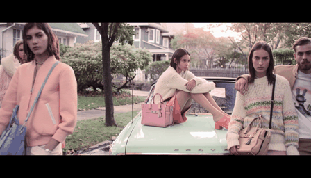
   
   <br>
   Links trainiert mit 2 Epochen, Rechts mit 10 Epochen
   <br>
   <br>

   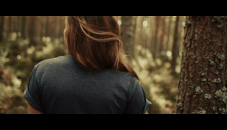
   
   <br>
   
   
   <br>
   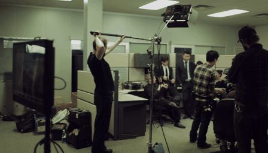
   
   <br>
   Links trainiert mit 10 Epochen, Rechts mit 30 Epochen
   <br>
   <br>

   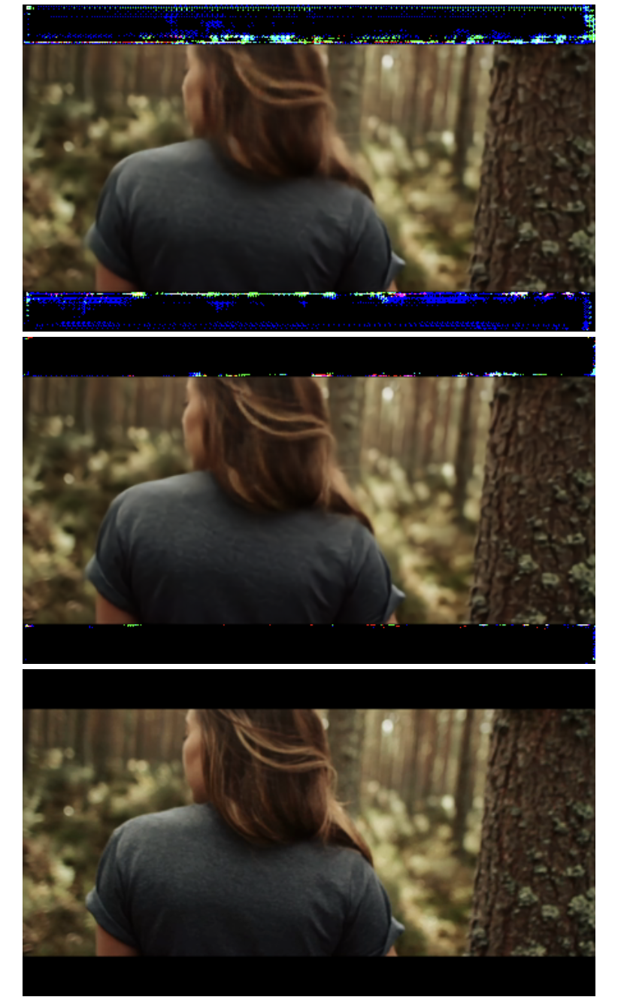
   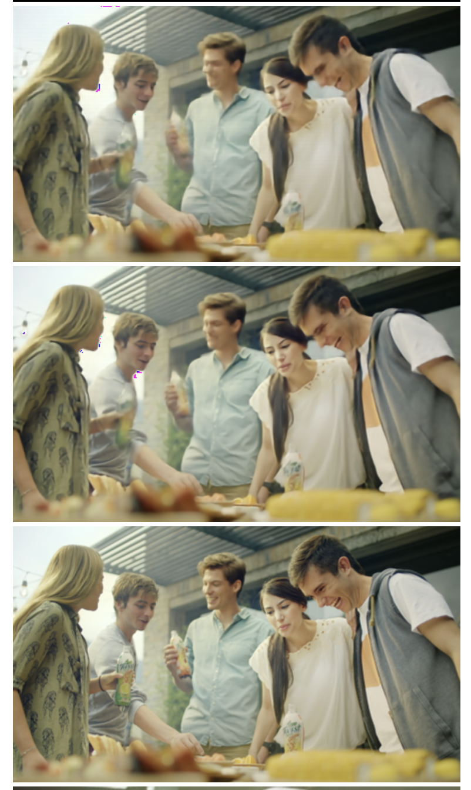
   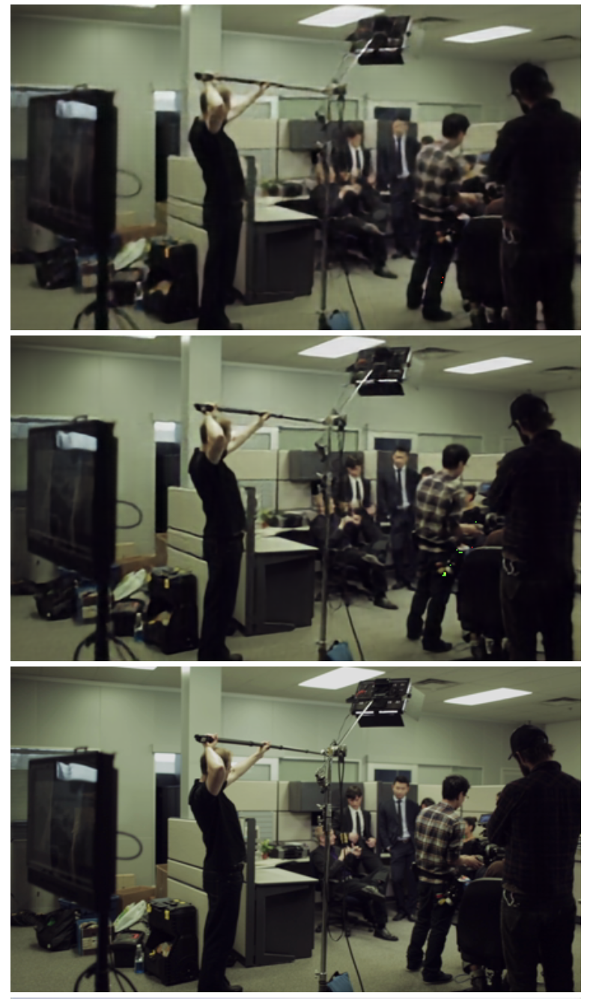
   <br>
   Oben mit 10 Epochen, Mitte mit 30 Epochen, Unten das tatsächliche Bild
   <br>
   <br>
   **"Slow-Motion" (Generierte Bilder als Input nutzen):**
   <br><br>

   

   Beispiel eines sehr guten Ergebnisses (30 Epochen Training, 4 Iterationen)

   

   Beispiel eines sehr guten Ergebnisses (30 Epochen Training, 4 Iterationen)

   

   Beispiel eines eher weniger guten Ergebnisses - Starke Artefakte (30 Epochen Training, 4 Iterationen)

   

   Beispiel eines eher weniger guten Ergebnisses - "Warping" an linker Kerze (30 Epochen Training, 4 Iterationen)

   **Größerer Abstand zwischen Input-Bildern:**
   <br><br>

   

   Beispiel eines eigens extrahierten Videos. Hier die Referenz-Sequenz mit einem Frame Lücke zwischen den beiden Input-Bildern. (30 Epochen Training, 0 Iterationen)

   

   Beispiel eines eigens extrahierten Videos. Lücke zwischen Input Bildern: 10 (30 Epochen Training, 4 Iterationen)

   

   Beispiel eines eigens extrahierten Videos. Lücke zwischen Input Bildern: 20 (30 Epochen Training, 4 Iterationen)

   

   Beispiel eines eigens extrahierten Videos. Lücke zwischen Input Bildern: 40 - Starkes "Warping" (30 Epochen Training, 4 Iterationen)

## Probleme: Artifakte

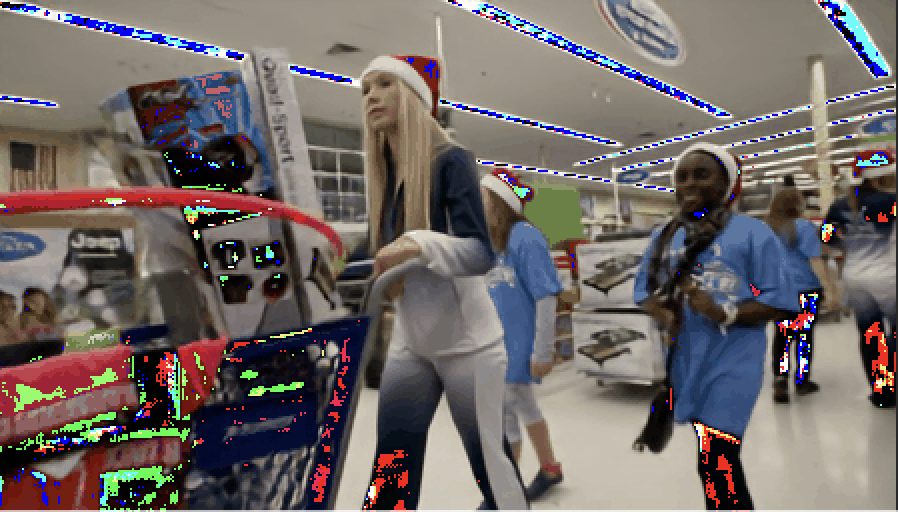
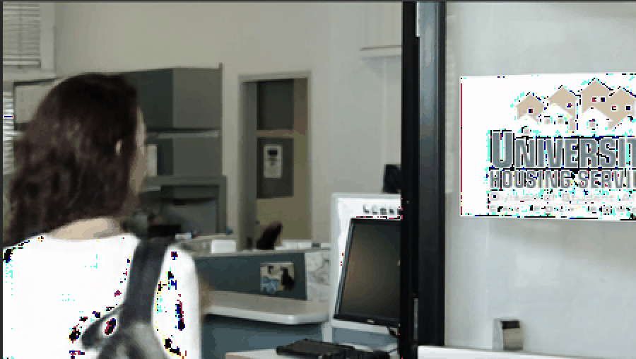

## Fazit
Wie schon in den obigen Bildern zu erkenn waren die größten Probleme, die Artifakte im Bild besonders an den sehr hellen & dunklen Stellen. <br>
Um dieses zu beheben werden in Papers wie Dain (https://arxiv.org/abs/1904.00830) Mechanismen eingeführt, zur Erkennung von Tiefe und dem Optical Flow. 
Dies war für uns im Rahmen des Semesterprojektes allerdings zu komplex und zeitintensiv.

Insgesamt sind wir mit den Ergebnissen zufrieden, besonders in der Zeit, die wir zur Verfügung hatten.
